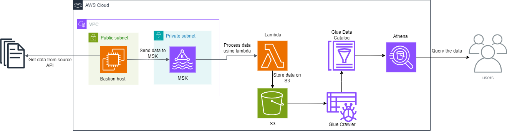

# Option 2 - API Data ingestion using MSK, Lambda, S3, Glue Crawler and Athena

## Description
This solution provides an automated data ingestion pipeline using Amazon Managed Streaming for Apache Kafka (MSK), AWS Lambda, Amazon S3, AWS Glue Crawler, and Amazon Athena. It allows for efficient processing and analysis of streaming data from an API source (https://restcountries.com/v3.1/all).

## Prerequisites
To run this project, you will need:
- An AWS account
- Terraform installed on your local machine
- AWS CLI configured with appropriate credentials

## Requirements
This project uses Terraform to manage the infrastructure. To install the required provider, run:

```bash
terraform init
```

For the Lambda function, ensure you have a `lambda_function.zip` file containing the Python code and dependencies.
The code is in the lambda folder. If you need to make any changes to the code or install new dependencies, make sure to do the following:

```bash
cd lambda
pip install -r requirements.txt -t .
zip -r ../lambda_function.zip .
```

### Important Note: The first time running the pipeline, there might be a problem invoking the Lambda function. This is because of the group_id. A solution for this might be to temporarily delete the group_id to allow Lambda to start, and then restore it afterward, as it's very important for the offset.
## Design


This solution consists of the following components:
1. EC2 Bastion Host: Acts as a client to fetch data from an API and send it to MSK
2. Amazon MSK Cluster: Handles the streaming data
3. AWS Lambda: Processes the data from MSK and stores it in S3
4. Amazon S3: Stores the processed data
5. AWS Glue Crawler: Catalogs the data in S3
6. Amazon Athena: Allows for querying the data using SQL

The data flow is as follows:
1. The EC2 bastion host fetches data from an API every 10 seconds and sends it to the MSK cluster.
2. The EC2 host also invokes the Lambda function every 10 seconds.
3. The Lambda function processes the data from MSK and stores it in S3.
4. The Glue Crawler catalogs this data, making it available for analysis in Athena.

## Developer Guide
To continue development on this project:

1. EC2 Bastion Host Setup:
   - An EC2 instance is set up as a bastion host for accessing the private resources and running scripts.
   - It has two main scripts:
     a. `send_countries_to_kafka.py`: Fetches data from the REST Countries API and sends it to MSK.
     b. `invoke_lambda.py`: Invokes the Lambda function every 10 seconds.
   - These scripts are set up as systemd services to run continuously.

2. MSK Cluster Setup:
   - The MSK cluster is configured with 3 broker nodes across different availability zones.
   - It uses Kafka version 2.8.1 and t3.small instances.
   - Encryption in transit is set to PLAINTEXT, and encryption at rest uses a KMS key.

3. Lambda Function:
   - The Lambda function is set up to read from the MSK cluster and write to S3.
   - It processes country data, calculates additional metrics, and stores the results in S3.
   - The function uses the Kafka-Python library to consume messages from MSK.
   - It processes up to 10 messages per invocation and uploads the results as a JSON file to S3.
   - Key features of the Lambda function:
     * Consumes messages from the 'countries_data' Kafka topic
     * Calculates population density for each country
     * Determines if a country is "large" based on its area
     * Extracts relevant information from the raw country data
     * Uploads processed data to S3 in batches
   - The function has permissions to interact with MSK, S3, and create network interfaces.

4. S3 Bucket:
   - A bucket named "${var.global_prefix}-for-country-data" is created to store the processed data.
   - Public access is blocked for security.

5. Glue Crawler:
   - A Glue Crawler is set up to catalog the data in the S3 bucket.
   - It runs on a schedule: "cron(0 * * * ? *)" (every hour).

6. Athena: 
   - An Athena workgroup is created for querying the data.
   - Query results are stored in a separate S3 bucket.
   - Note: Make sure to change the workgroup to 'countries_workgroup'

7. Networking:
   - A VPC is set up with private subnets for the MSK cluster and a public subnet for the bastion host.
   - Security groups are configured to allow necessary traffic.

To make changes:
1. Modify the Terraform files as needed.
2. Update the EC2 user data script if changes to the data ingestion or Lambda invocation process are required.
3. If you need to modify the Lambda function, update the code in the lambda folder and repackage it as described in the Requirements section.
4. Run `terraform plan` to see the changes that will be applied.
5. If the plan looks good, apply the changes with `terraform apply`.

## EC2 Bastion Host Scripts

### send_countries_to_kafka.py
This script fetches data from the REST Countries API and sends it to the MSK cluster. It runs as a systemd service and sends data for one country every 10 seconds.

### invoke_lambda.py
This script invokes the Lambda function every 10 seconds. It also runs as a systemd service.

Both scripts are set up automatically when the EC2 instance is launched, using the user data script. The user data script also installs necessary dependencies, sets up the Kafka environment, and creates systemd service files for both scripts.


## Troubleshooting 

### Connect to EC2 instance 
In case you need to ssh to the ec2 instance you can do so by first changing the permission of 
```cert.pem``` file by running 
```bash
chmod 400 cert.pem
``` 
then run
```bash
ssh ec2-user@<public-ip-address> -i cert.pem
``` 
you'll get this in output after resources are created.
### Note: sometimes you might need to run the previous command using sudo


To see data sent to kafka use the command, the brokers will be on the output also
```bash
kafka-console-consumer.sh --bootstrap-server <broker> --topic countries_data --from-beginning
```
If you want to stop/start sending the data to msk or stop/start invoking the lambda function or check the status you can use the commands
```bash
sudo systemctl start kafka-countries
sudo systemctl stop kafka-countries
sudo systemctl status kafka-countries

sudo systemctl start invoke-lambda
sudo systemctl stop invoke-lambda
sudo systemctl status invoke-lambda
```


## Author
Ismail DAOUDI
idaoudi240@gmail.com
